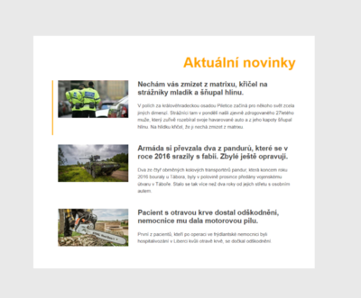

# Lekce 06
# Cvičení: Manipulace s DOMem

<strong>Úkol č. 1: Novinky</strong>

Vytvořte si repozitář ze šablony cviceni-novinky. V repozitáři je připravena webová stránka, která zobrazuje několik zajímavých zpráv. Zobrazte stránku v prohlížeči a veškeré úkoly z tohoto cvičení proveďte v JavaScriptové konzoli.

Pomocí document.querySelector vyberte element body a uložte si jej do proměnné bodyElm. Pomocí této proměnné nastavte barvu pozadí elementu na hodnotu #e9e9e9.
Do jiné proměnné vyberte element s třídou news a nastavte mu barvu pozadí na bílou a maximální šířku na 60rem.
Vyberte element h1 a nastavte mu (v JavaScriptu) třídu na news__title. Nadpis by měl změnit styl. Nastavte také obsah nadpisu na text Aktuální novinky.
Pomocí atributu id vyberte element obsahující první zprávu. Přidejte do jeho atributu class třídu post--main. První zpráva by tak měla mírně změnit svůj styl.
Vyberte obrázek v poslední zprávě (tu vyberte podle id) a změnte jeho atribut src na obrázek img/zprava3-novy.jpg.
Na konci by stránka v prohlížeči měla vypadat jako na obrázku níže:

Used methods: Array.forEach(), Event.currentTarget property, querySelectorAll(), addEventListener()
